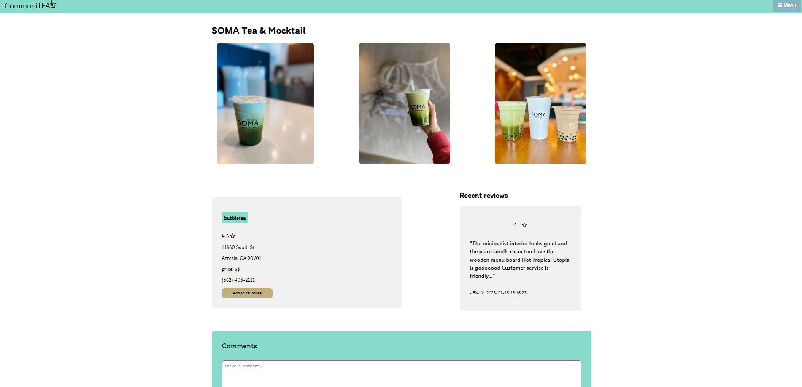

# CommuniTEA


[CommuniTEA Link](https://tranquil-plains-63846.herokuapp.com/)
## Description

This MERN stack web app lets users browse a wide selection of delicious milk tea businesses where they can view information about specific Milk Tea stores.

Users are able to view store reviews and can also leave their own reviews. Users can add different businesses to their favorites list as well.

Create a free account and get started today!

## Table of Contents

1. [User Stories](#user-stories)
2. [Technologies Used](#technologies-used)
3. [Usage](#usage)
4. [Contributors](#contributors)
5. [Installation](#installation)
6. [Issues](#issues)

## User Stories

- User can search a keyword or search for a business to review
- User can create an account and login
- User can leave reviews and rating for a business
- User can add a business to their favorites list

## Technologies Used

- [x] JavaScript (ES6+)
- [x] React
- [x] Node.js
- [x] Express.js
- [x] MongoDB
- [x] Mongoose
- [x] GraphQL
- [x] Ant Design
- [x] Deployed on Heroku
- [x] Yelp Fusion API

## Usage

Deployed application: https://tranquil-plains-63846.herokuapp.com/

```
Register or Log in
Enter a location (city, state, zip code, etc...) to search nearby Milk Tea Places
Click into a store and click the favorite store button to add the store to the database as well as you favorites list.
```

## Contributors

[Stephanie Tseng](https://github.com/wytseng)

[Johnathan Nguyen](https://github.com/jthnguyen9909)

[Darius Garcia](https://github.com/dariusgarcia/)

[Justin Chen](https://github.com/JustinCChen)

[Japbir Chhina](https://github.com/japchhina)

## Installation

clone the repo to local machine

```
cd communitea/
```

install dependencies

```
npm install
```

seed database

```
cd server/

npm run seed
```

start development React client and Express server

```
npm run develop
```

### Client

start client

```
cd client/
```

```
npm run start
```

build app for production

```
npm run build
```

### Server

start server

```
cd server/
```

```
npm run start
```

## Issues

This is still an application under development, therefore certain functionalities are not fully functioning yet.

Working functionalities:
- Register, Login & Log out
- Search query for stores based on location via Yelp Fusion
- Add Store (fully functioning)
- Favorite Store (though is errorous when multiple stores are favorited)

However, all queries and mutations are working on the back end and can be tested with sandbox gql.
